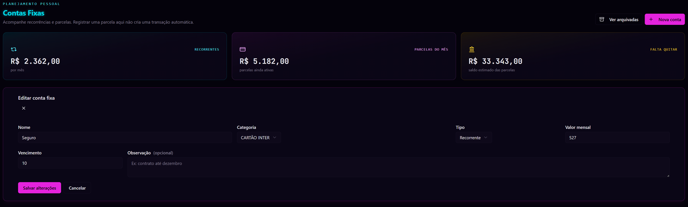

<div align="center">

# Controle Financeiro

**Painel financeiro web em produção — do controle pessoal a um sistema multiusuário com contas convidadas**

[](https://controlefinanceirosnay.com)


[Acessar o sistema](https://controlefinanceirosnay.com) · [Portfólio](https://nicolasmoreiraferreira.github.io/portfolio/) · [LinkedIn](https://www.linkedin.com/in/nicolasmoreiraferreira/)

</div>

---

## Sobre este repositório

Este repositório é a **vitrine técnica** do Controle Financeiro. Ele documenta o sistema, a arquitetura
e as decisões de engenharia — **o código-fonte é privado**, porque a aplicação está em produção com
dados financeiros reais de pessoas e com credenciais de integração.

O que está aqui é exatamente o que eu apresento em entrevista: o problema, as escolhas técnicas, os
trade-offs e as capturas do sistema rodando de verdade.

## O problema

Eu queria controlar minha vida financeira sem depender de lançar tudo à mão em planilha. O requisito
real não era "ter um app de finanças", era: **registrar um gasto no momento em que ele acontece**, sem
abrir sistema nenhum, e ainda conseguir enxergar contas fixas, fatura de cartão, orçamento, metas e
patrimônio em um lugar só.

Depois o escopo cresceu: outras pessoas quiseram usar o mesmo painel. Isso transformou um projeto
pessoal em um problema de **isolamento de dados por conta**, com convite, onboarding próprio e
credenciais separadas — sem que ninguém enxergue o dado de ninguém.

## O que o sistema faz

| Área | O que resolve |
| --- | --- |
| **Dashboard** | Visão do mês: entradas, saídas, saldo e evolução |
| **Transações** | CRUD com filtros, categorias, anexo de comprovantes e vínculo com cartão |
| **Lançamento por WhatsApp** | Escreve a mensagem e o gasto entra sozinho, já classificado |
| **Cartões de crédito** | Ciclo de fatura, compras do ciclo, pagamento e contas fixas vinculadas |
| **Contas fixas** | Recorrentes e parceladas, com cartão vinculado direto no formulário |
| **Orçamentos** | Limite por categoria, com acompanhamento do consumo |
| **Metas financeiras** | Objetivo, aportes e recomendação de contribuição |
| **Patrimônio** | Ativos, passivos e patrimônio líquido ao longo do tempo |
| **Regras de classificação** | Regras priorizadas que classificam automaticamente novos lançamentos |
| **Detector de duplicidades** | Cruza manual, WhatsApp e planilha — somente leitura, sem ação automática |
| **Relatórios** | Resumo mensal, comparativos e destaques por categoria |
| **Backup e restauração** | Exportação em JSON, validação do arquivo e cópia automática antes de substituir |
| **Planilha** | Sincronização com credencial exclusiva por conta e deduplicação por chave |

## Arquitetura

```
┌──────────────────────────────────────────────────────────────────┐
│  Navegador — React 19 + TypeScript + Tailwind CSS                │
│  Consumo tipado via tRPC: sem contrato duplicado à mão           │
                                │  tRPC sobre HTTP
                                ▼
┌──────────────────────────────────────────────────────────────────┐
│  Servidor — Node.js + Express                                    │
│  Routers tRPC · validação com Zod · sessão autenticada           │
├──────────────────────────────────────────────────────────────────┤
│  Domínio — funções puras, testadas isoladamente                  │
│  fixedBillMath · creditCardMath · financialGoalMath              │
│  monthlyBalance · monthlyReportMath · financialPlanningMath      │
│  duplicateDetector · goalContributionRecommendation              │
├──────────────────────────────────────────────────────────────────┤
│  Persistência — Drizzle ORM + MySQL                              │
│  Isolamento por userId em toda consulta · índices únicos         │
└────────────────────────────────┬─────────────────────────────────┘
                                │
      ┌─────────────────────────┼─────────────────────────┐
      ▼                         ▼                         ▼
      Evolution API             Armazenamento             Sincronizador
      (webhook do WhatsApp)     de arquivos (S3)          de planilha
```

### Decisões que valem explicar

**tRPC em vez de REST escrito à mão.** O contrato entre front-end e back-end é derivado dos próprios
procedimentos. Se eu mudar o formato de retorno de uma procedure, o TypeScript acusa o erro no
componente que a consome — antes de rodar. Em um sistema que cresceu para dezenas de procedures, isso
eliminou a classe de bug mais chata: resposta que muda e tela que quebra silenciosamente.

**Lógica de domínio em funções puras.** Cálculo de fatura, saldo mensal, aporte de meta e detecção de
duplicidade não moram dentro das rotas. São funções que recebem dados e devolvem resultado, sem tocar
no banco — o que torna possível testar cada regra isoladamente, sem subir servidor.

**Idempotência por identificador de mensagem.** O webhook do WhatsApp pode reenviar o mesmo evento, e
o próprio bot pode gerar uma resposta que volta como mensagem. Cada lançamento carrega o identificador
da mensagem de origem, com índice único no banco: a segunda tentativa é recusada na origem, não tratada
depois. Sem isso, um reenvio vira gasto duplicado.

**Detector de duplicidades que não decide sozinho.** Quando o mesmo gasto entra por dois caminhos
(manual e WhatsApp, por exemplo), o sistema **mostra** o par com o grau de confiança e espera decisão
humana. Automatizar a exclusão aqui seria perigoso: dois cafés de valores iguais no mesmo dia são
lançamentos legítimos, não erro.

**Isolamento por conta desde o começo.** Toda consulta é escopada pelo identificador do usuário, e o
convite é nominal. Quem entra pelo convite começa com painel vazio, sem nenhum dado de outra conta, e
recebe credencial de sincronização própria. O procedimento de rollback do isolamento se recusa a rodar
se já existirem dados de convidados — proteger dado de terceiro vem antes de facilitar manutenção.

**Estado de operação crítica sempre confirmado.** Restauração de backup exige a palavra `RESTAURAR` e
guarda uma cópia automática antes de substituir. Reversão de lançamento é aceita uma única vez por
identificador de mensagem — foi um bug real, encontrado em uso, que virou regra testada.

## Qualidade

| Prática | Situação |
| --- | --- |
| TypeScript | Modo estrito, sem `any` solto nas rotas |
| Validação de entrada | Zod nos limites do servidor |
| Testes automatizados | Mais de 130 testes (Vitest), incluindo integração |
| Cobertura de regra de negócio | Cálculo de fatura, saldo, metas, duplicidade e idempotência |
| Verificação antes de publicar | Checagem de tipos, testes e build a cada entrega |
| Revisão visual | Telas conferidas em desktop e celular |

## Capturas

<div align="center">

### Painel de contas fixas


### Lançamento por WhatsApp


</div>

## Stack

| Camada | Tecnologia |
| --- | --- |
| Interface | React 19, TypeScript, Tailwind CSS |
| Comunicação | tRPC 11 sobre Express |
| Validação | Zod |
| Banco de dados | MySQL com Drizzle ORM e migrations versionadas |
| Integração | Evolution API (WhatsApp), armazenamento de arquivos, sincronizador de planilha |
| Testes | Vitest |
| Autenticação | Sessão com provedor OAuth |

## Status

**Em produção.** O sistema roda com uso diário real, recebe lançamentos por WhatsApp e atende contas
convidadas com dados isolados. Está em evolução contínua: cada correção publicada entra com teste que
impede a regressão.

## Sobre o código

O código-fonte é privado por conter dados financeiros reais e credenciais de integração.

**Em uma conversa eu apresento:** a estrutura dos routers tRPC, o modelo de dados, as funções de
domínio, os testes, o fluxo de idempotência do webhook e as decisões de isolamento por conta.

---

<div align="center">
<sub>Desenvolvido por <a href="https://github.com/nicolasmoreiraferreira">Nicolas Moreira Ferreira</a> — São Vicente, SP</sub>
</div>
